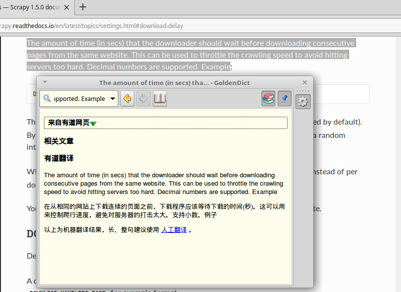
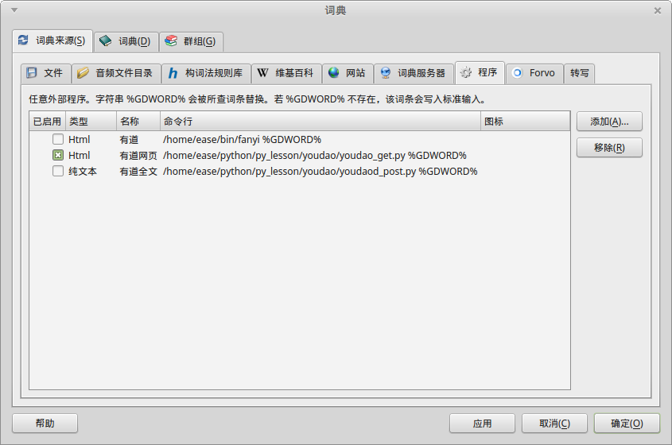

# 有道翻译 for GoldenDict 完美取词插件

## 最新更新

**2019.2.4**  
用 requests 对有道插件进行了重写。requests 可读性更好，操作更加方便。 同时对结果样式做了微调，如果翻译结果有图片，则对图片进行 float:right 不影响结果读取。

## 概述

完美解决 Linux 环境下，屏幕取词定位不准确，有很多软件界面甚至无法取词的问题。并可以进行整段即时翻译，翻译结果优秀。

在 Windows 环境下，有很多可用的即时翻译翻译软件，屏幕取词功能一般都比较好用，取词准确，快速响应。近几年尤其以有道效果相对比较好，在windows 环境下获得众多用户和比较好的口碑，笔者自己用的也是有道。但是再 Linux 环境下一直没有效果比较好的屏幕取词软件，最近发现有道出了 Linux 版，经过试用 在 vscode 下取词定位不准确，几乎无法使用。整段翻译也有问题。

GoldenDict 是 Linux 环境下一款整合翻译软件，可以把互联网上全世界范围内，各种翻译软件，通过“接口”的方式整合到 GoldenDict 里面。软件默认选项中没有适合中文翻译以及中文取词的适合的接口。笔者尝试配置了有道的翻译，显示结果非常不好，显示内容不匹配窗口。好吧发挥Python能力的时候到了。根据 GoldenDict 提供的功能来看，用Python实现一个插件负责采集有道或者其他翻译系统的结果，并整合到GoldenDict应该是可以实现的。。。。因此本插件就出现了

## 功能

* youdao_get.py     get（url）方式调用有道网页翻译接口，经过测试翻译效果非常不错。唯一问题，段落太大时可能翻译不完全。
* youdao_post.py    post 方式调用有道全文翻译接口，比较适合整片文章的翻译。
* /dist/            文件夹下为打包好的插件，如果对于linux 不熟悉，直接拷贝里面的单独文件即可。
* 命令行单词翻译      命令行输入`$ ./youdao_get.py coroutine` 返回html结果
* 命令行整段翻译      命令行输入<code>$ ./youdao_post.py "\`cat test/text.txt \`"</code> 注意所有符号
* get接口整段翻译     命令行输入<code>$ ./youdao_get.py "\`cat test/text.txt \`"</code>  注意所有符号

## 效果展示

### firefox 网页取词效果

### vscode 单字取词效果

### vscode 代码编辑器整段取词效果

## 安装

### 熟悉 Linux & Python 环境的用户

1. 先安装 Python3 环境，本插件代码是运行在 python3.5.x 下的。
2. 打开youdao_get.py,youdao_post.py源代码，根据需要安装所需要的第三方包。
3. 注意 Linux 默认 python 命令运行的是 python2.x python3 运行的是 python3,安装第三方包也要用 pip3
4. 把 youdao_get.py 和 youdao_post.py 放置到自己的可执行文件目录。sudo chmod 755 youdao_get.py 赋予可执行权限。
5. 最后按照下图配置GoldenDict，全部安装完毕

    

### 不熟悉 Linux & Python

1. 下载 dist 目录下的 youdao_get 和 youdao_post 可执行文件。
2. 放置到自己的目录，比如：/home/你的用户名/youdao
3. 给 youdao_get,youdao_post 添加可执行权限：
<code>sudo chmod 755 youdao_get.py</code>
<code>sudo chmod 755 youdao_post.py</code>
4. 按照上图给配置GoldenDict,全部安装完毕
